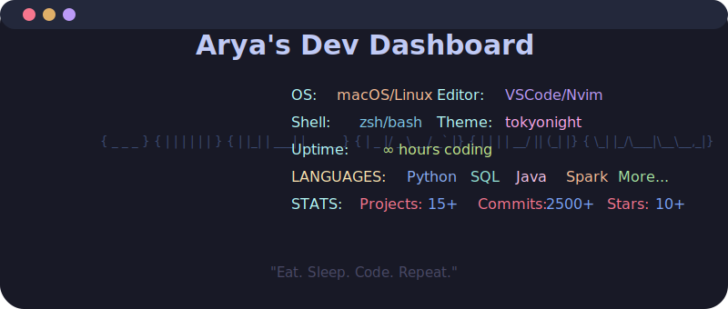

<div align="center">

<!-- HEADER WAVE -->


<!-- ANIMATED TYPING -->
<a href="https://git.io/typing-svg"></a>

<!-- BADGES ROW -->
<p>
<a href="https://arya-mehta.vercel.app/"></a>
<a href="https://www.linkedin.com/in/aryamehta26/"></a>
<a href="https://medium.com/@aryamehta"></a>
<a href="mailto:aryamehta456@gmail.com"></a>

</p>

<br>

<!-- CUSTOM DASHBOARD SVG -->


</div>

---

<!-- ABOUT -->
## `> whoami` 👨‍💻

```yaml
name: Arya Mehta
location: San Francisco Bay Area 🌉
education: MS Applied Data Science — San Jose State University (2025–2026)
open_source: Contributed Agentic Commerce pattern to LangGraph (Python) 🔥
experience: 2+ years shipping production systems at scale
currently_building: Multi-agent AI systems & distributed data platforms
motto: "I build systems that run while the world sleeps."
fun_fact: "Some of my best code gets written after sunset 🦉"
```

<div align="center">

<!-- OPEN SOURCE CALLOUT -->
<a href="https://github.com/langchain-ai/langgraph">

</a>


</div>

---

<!-- STATS SECTION -->
## ⚡ GitHub Analytics

<div align="center">

<!-- TROPHIES -->


<br>

<!-- STATS + STREAK SIDE BY SIDE -->
<table>
<tr>
<td width="50%">

</td>
<td width="50%">

</td>
</tr>
</table>

<br>

<!-- CONTRIBUTION GRAPH -->


<br><br>

<!-- LANGUAGE DONUT -->


</div>

---

<!-- TECH ARSENAL - MASSIVELY EXPANDED -->
## 🛠️ Tech Arsenal

<div align="center">

### 💻 Languages
<p>

<br>

</p>

### 🤖 AI, Agents & Machine Learning
<p>


<br>


</p>

### ⚙️ Backend & Web
<p>


<br>

</p>

### 🗄️ Data Systems & Infrastructure
<p>


<br>


</p>

### ☁️ Cloud & DevOps
<p>

<br>


</p>

</div>

---

<!-- FEATURED PROJECTS WITH DEEP DESCRIPTIONS -->
## 🏆 Featured Projects

<!-- PROJECT 1: LayoverOS -->
<table>
<tr>
<td width="100%">

### 🧠 [LayoverOS](https://github.com/aryaMehta26/LayoverOS) — Multi-Agent Recovery System
**`Python` `FastAPI` `LangGraph` `MongoDB Atlas Vector Search` `Next.js` `Coinbase CDP`**

> 🏅 *MongoDB Agentic Hackathon*

- Architected a **multi-agent state machine** using LangGraph — Supervisor node routes intent to **autonomous agents** (Scout, Flight, Bursar) for parallelized context execution
- Engineered a **zero-hallucination RAG pipeline** on MongoDB Atlas Vector Search with 1024-dim Voyage AI embeddings + strict metadata pre-filters → **100% data accuracy**
- Implemented **Agentic Commerce** via Coinbase CDP — AI autonomously constructs transaction payloads and triggers Generative UI payment modals in Next.js
- Built self-healing fallback mechanism: MongoDBSaver checkpointing for persistent multi-turn memory + auto-rerouting to raw DB queries during LLM outages

<div align="center">
<a href="https://github.com/aryaMehta26/LayoverOS"></a>
</div>

</td>
</tr>
</table>

<!-- PROJECT 2: SJ Hopes -->
<table>
<tr>
<td width="100%">

### 🏗️ [SJ Hopes](https://github.com/aryaMehta26/sj-hopes) — Real-Time Collaborative Platform
**`TypeScript` `React` `Next.js` `Java` `Spring Boot` `MySQL` `WebSocket` `Redis`**

> 🥈 *2nd Prize among 300+ teams — 48-hour hackathon*

- Won 2nd place with **real-time collaboration** via WebSocket, geospatial algorithms (Haversine), and R-trees for location queries
- Scaled to **1,000+ concurrent users** using connection pooling, database sharding, and Redis caching → **<100ms P95 response time**
- Applied **graph algorithms** (Dijkstra's) for route optimization and collaborative filtering for recommendations
- Achieved **95% test coverage**; implemented PWA features including offline support and push notifications

<div align="center">
<a href="https://github.com/aryaMehta26/sj-hopes"></a>
</div>

</td>
</tr>
</table>

<!-- PROJECT 3: Distributed Data Platform -->
<table>
<tr>
<td width="100%">

### ⚡ [Distributed Data Platform](https://github.com/aryaMehta26/data-platform) — Production-Grade ETL at Scale
**`Python` `Airflow 2.x` `Spark 3.5` `FastAPI` `Docker` `Kubernetes (EKS)` `Prometheus` `Grafana`**

> 📊 *5 TB+/day • 100+ concurrent jobs • 99.9% uptime*

- Orchestrated **5 TB+/day ETL** on Kubernetes/EKS using Airflow + Spark-on-K8s — tuned partitioning & predicate pushdown → **−60% shuffle, −55% wall-clock, −40% infra cost**
- Instrumented a **50+ rule data-quality framework** (nulls, uniqueness, ranges, regex, temporal) → exported to Prometheus with Grafana SLO dashboards → **anomalies −85%**
- Shipped FastAPI microservice with readiness/liveness probes + gunicorn/uvicorn → maintained **p95 < 100ms**; hardened with RBAC, resource limits, retries
- Automated CI/CD via GitHub Actions (tests + image builds), versioned K8s manifests, and runbooks for on-call troubleshooting

<div align="center">
<a href="https://github.com/aryaMehta26/data-platform"></a>
</div>

</td>
</tr>
</table>

<br>

<details>
<summary><b>🔥 More Projects</b></summary>
<br>

<div align="center">

<a href="https://github.com/aryaMehta26/Graph-Based-Fraud-Intelligence-Platform">

</a>
<a href="https://github.com/aryaMehta26/enterprise-rag">

</a>
<a href="https://github.com/aryaMehta26/Netflix_popularity_Predicition">

</a>
<a href="https://github.com/aryaMehta26/multi-step-AI-pipelines">

</a>
<a href="https://github.com/aryaMehta26/Automated-Data-Governance-Metadata-Catalog">

</a>
<a href="https://github.com/aryaMehta26/isaac-sim-synth-data">

</a>

</div>

</details>

---

<!-- EXPERIENCE HIGHLIGHTS -->
## 💼 Experience

<div align="center">

```
┌─────────────────────────────────────────────────────────────────────────┐
│                                                                         │
│  MeteoControl — Software Engineer                  Jan 2024 – Dec 2024  │
│  ─────────────────────────────────────────────────────────────────────── │
│  • Shipped weekly across Java/Spring Boot + React/TS for 10k+ users     │
│  • O(n²) → O(n log n) via B+ trees & hashing → +40% throughput         │
│  • Blue-green/canary deploys, circuit breakers → 99.9%+ availability    │
│  • Built Python/Bash tooling → eliminated ~20 hrs/week manual toil      │
│                                                                         │
│  Dupat Infotronicx — Software Engineer Intern      Aug 2022 – Aug 2023  │
│  ─────────────────────────────────────────────────────────────────────── │
│  • Built web + data platform processing 1M+ records/day                 │
│  • Re-architected ETL → 3× faster processing, −65% CPU                 │
│  • REST APIs with ~95% test coverage, Agile sprints                     │
│                                                                         │
└─────────────────────────────────────────────────────────────────────────┘
```

</div>

---

<!-- CONTRIBUTION SNAKE -->
## 🐍 Contribution Snake

<div align="center">
<picture>
  <source media="(prefers-color-scheme: dark)" srcset="https://raw.githubusercontent.com/aryaMehta26/aryaMehta26/output/github-contribution-grid-snake-dark.svg">
  <source media="(prefers-color-scheme: light)" srcset="https://raw.githubusercontent.com/aryaMehta26/aryaMehta26/output/github-contribution-grid-snake.svg">
  
</picture>
</div>

---

<!-- CONNECT FOOTER -->
<div align="center">

### 💬 Let's Build Something

<p>
<a href="https://arya-mehta.vercel.app/"></a>
<a href="https://www.linkedin.com/in/aryamehta26/"></a>
<a href="https://medium.com/@aryamehta"></a>
<a href="mailto:aryamehta456@gmail.com"></a>
</p>

<br>


</div>
